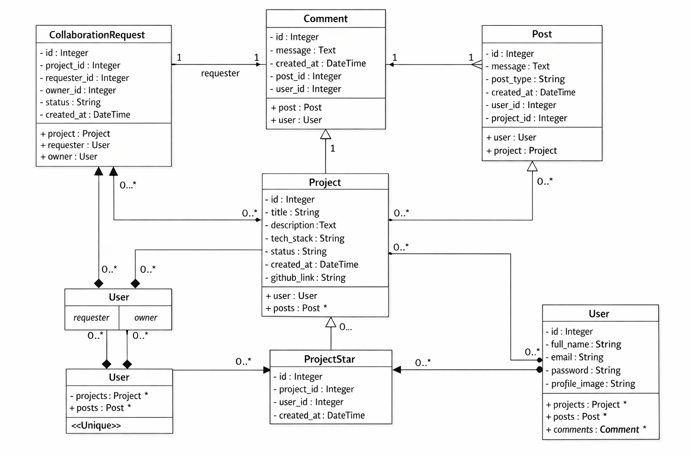
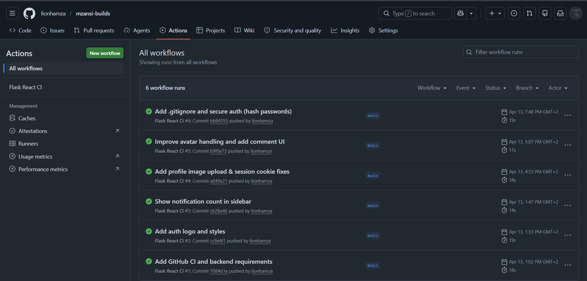
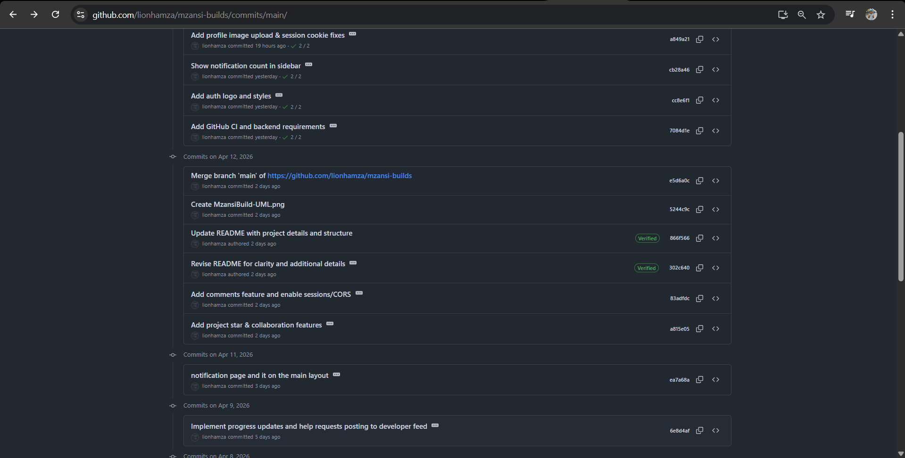

# MzansiBuilds – Developer Collaboration Platform

I developed **MzansiBuilds** as part of the **Derivco Code Skills Challenge 2026**.

This platform is designed to help developers **build in public**, share their progress, collaborate with others, and celebrate completed projects.

---

## Project Overview

My goal with this project was to create a social collaboration platform for developers where users can:

- create and manage their own accounts
- start and manage projects
- share milestones and progress updates
- request collaboration from other developers
- support projects through starring
- celebrate completed projects publicly

I wanted the platform to encourage **community learning, collaboration, and visibility of ongoing developer work**.

---

## User Journey Requirements Implemented

I implemented the following core user journey requirements:

### Account Management
- user registration
- user login and authentication
- session-based access control

### Project Management
- create new project entries
- add project stage
- specify support required
- continuously update milestones and progress

### Collaboration Features
- live feed of developer activity
- collaboration request system
- commenting and interaction
- project starring functionality

### Celebration Wall
When a developer completes a project, the project is displayed on a celebration wall to showcase successful builds.

---

## Tech Stack

### Frontend
- React.js
- JavaScript
- CSS

### Backend
- Flask
- Python
- SQLAlchemy ORM

### Database
- PostgreSQL

I chose :contentReference[oaicite:0]{index=0} because I wanted a robust relational database system that supports scalable data modeling and strong relationship handling through foreign keys.

### Version Control
- Git
- GitHub

---

## My System Architecture / UML Design

Below is the UML class diagram I created during the planning phase.

**Figure 1:** My UML class diagram showing the relationships between:

- User
- Project
- Post
- CollaborationRequest
- ProjectStar

I created this UML before implementation to help me plan the system architecture and database relationships properly.

---

## Database Design

I implemented the backend database using PostgreSQL.

Some of the key relationships I designed include:

- one user can own many projects
- one project can contain many progress posts
- many users can star many projects
- collaboration requests connect developers to project owners

This was implemented using SQLAlchemy ORM models.

---

## My Software Engineering Best Practices

Throughout the development process, I followed software engineering best practices such as:

- modular component design
- reusable frontend components
- clean backend route separation
- RESTful API structure
- clear naming conventions
- separation of frontend and backend concerns
- version control using Git

---

## CI / CD Workflow

Below is my CI / CD workflow evidence.

I used continuous integration principles to support code validation and automated workflow checks during development.

---

## Testing & Code Quality

Below is evidence of my testing workflow.

To ensure code quality, I considered testing for:

- authentication route validation
- project creation route testing
- collaboration request logic
- frontend interaction flows

This demonstrates my focus on writing clean and maintainable code.

---

## Security Considerations

I treated security as an important part of the development process.

Security measures I considered include:

- protected authentication routes
- session management
- input validation
- ORM usage to reduce SQL injection risks
- access control checks
- safe database operations

I ensured that security was part of the design process and not an afterthought.

---

## My Git Workflow & Version Control

Below is my Git workflow evidence.

I followed an incremental Git workflow with commits such as:

- initial project setup
- authentication implementation
- project feed development
- collaboration request feature
- star functionality
- UI improvements

This demonstrates my use of version control and structured development.

---

## Reusability and Documentation

I designed the project with reusability in mind.

Examples include:

- reusable React components
- reusable Flask routes
- modular database models
- shared utility functions
- maintainable folder structure

I also documented my thought process through this README and UML design.

---

## Evidence of My Own Thinking

This project reflects my own thinking and methodology through:

- requirement analysis
- project planning
- UML design
- architecture decisions
- security considerations
- testing workflow
- version control discipline

This demonstrates my software engineering approach in alignment with the challenge requirements.

---

## Author

**Hamza Madi**  
Derivco Code Skills Challenge 2026
