# MzansiBuilds – Developer Collaboration Platform

I developed **MzansiBuilds** as a **personal project** to explore how developers can collaborate, build in public, and showcase their work in a structured and engaging way.

This platform enables developers to **build in public**, share progress, collaborate with others, and celebrate completed projects.

---

## Project Overview

The goal of this project was to design a social collaboration platform where developers can:

* create and manage accounts
* start and manage projects
* share milestones and progress updates
* request collaboration from other developers
* support projects through starring
* communicate through a project group chat as collaborators
* celebrate completed projects publicly

The platform encourages **community learning, collaboration, communication, and visibility of ongoing developer work**.

---

## User Journey Requirements Implemented

### Account Management

* user registration
* user login and authentication
* session-based access control

  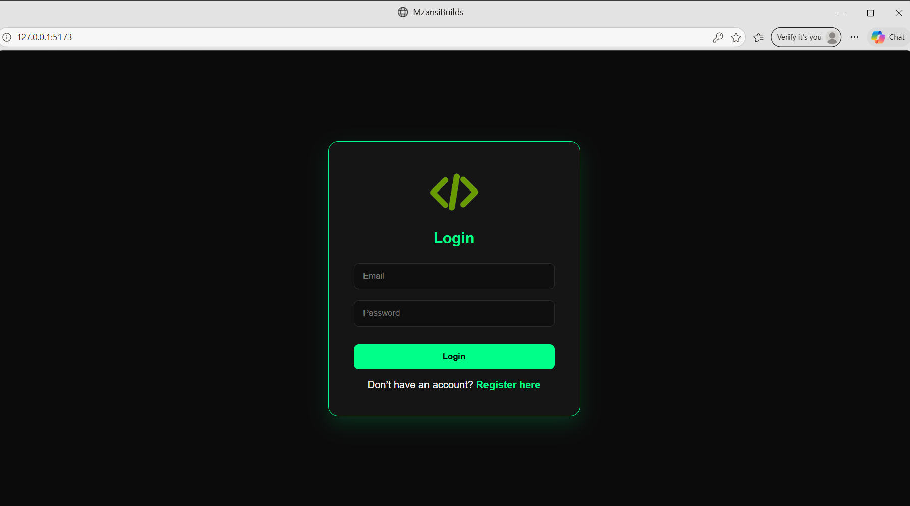
  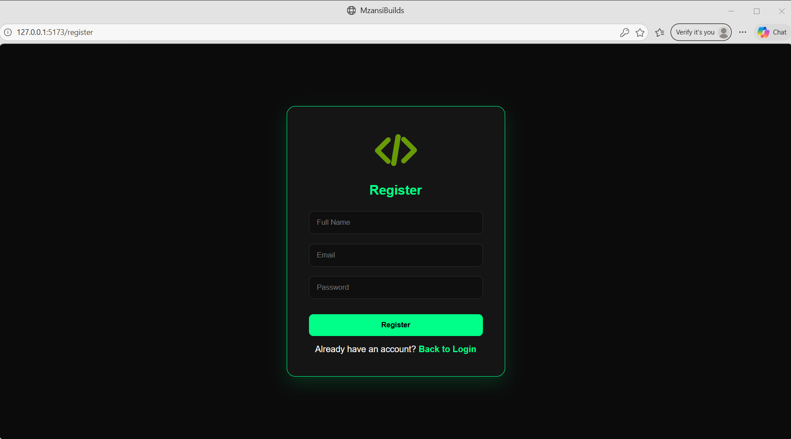 
  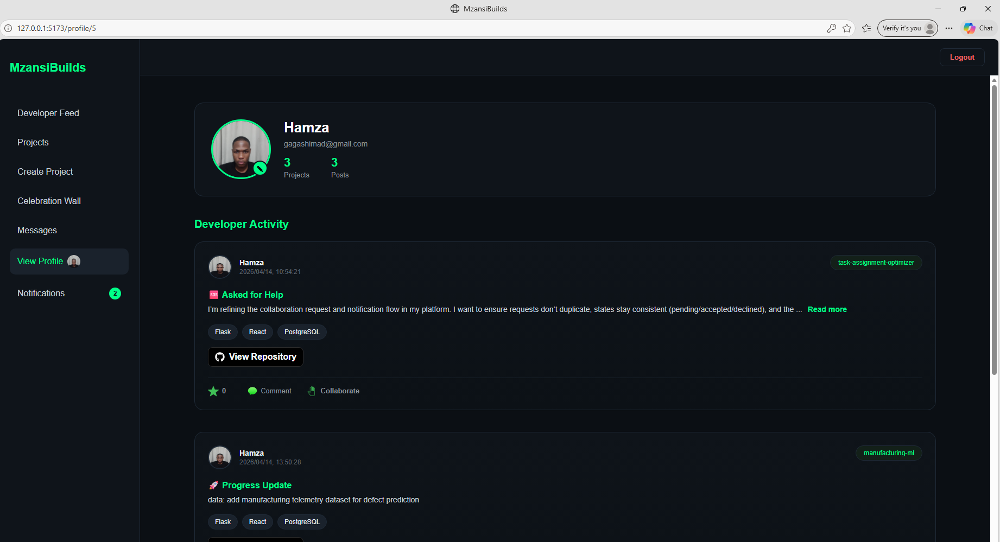 

---

### Project Management

* create new project entries
* define project stage
* specify required support
* continuously update milestones and progress

  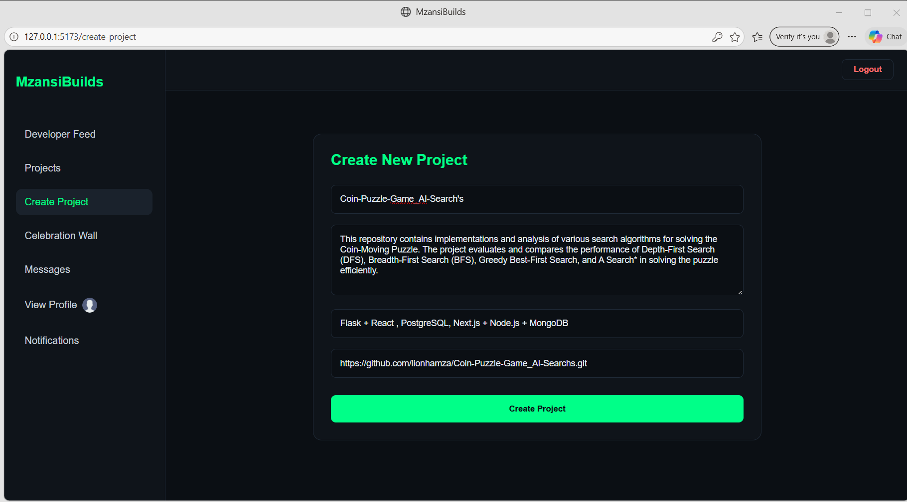
  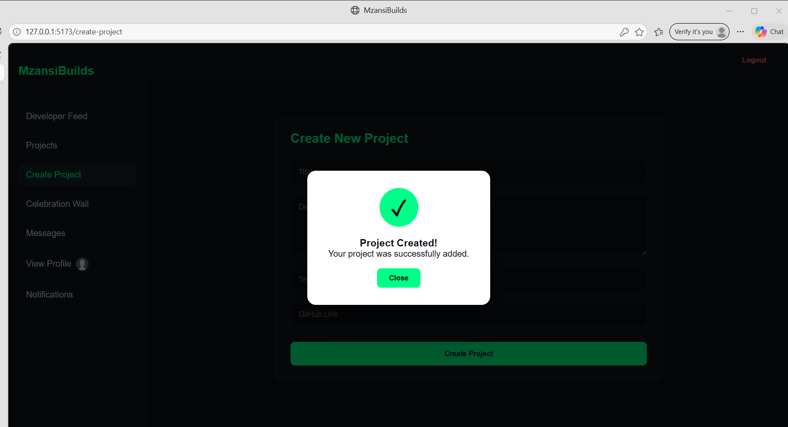
  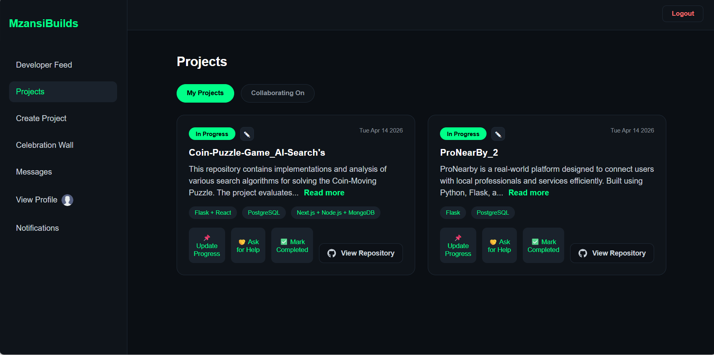
  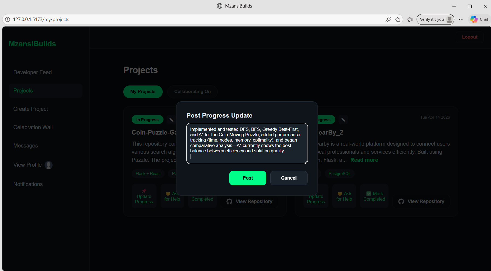

---

### Collaboration Features

* live feed of developer activity
* collaboration request system
* commenting and interaction
* project starring functionality
* project group chat for accepted collaborators

  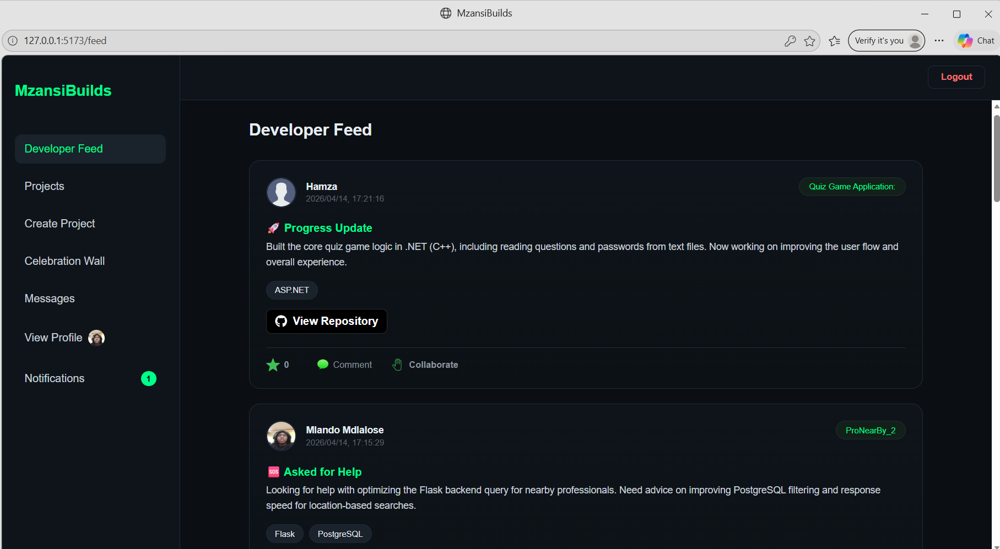
  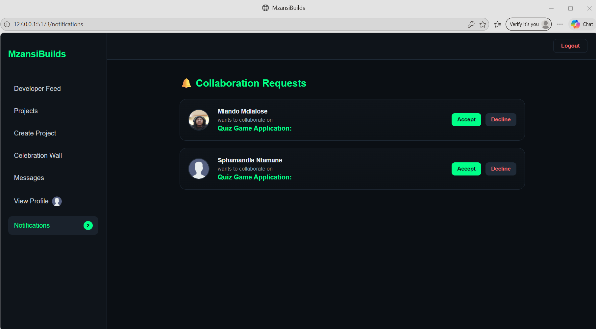
  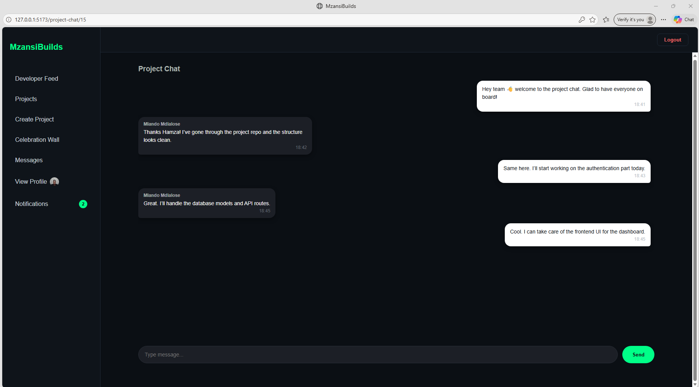
  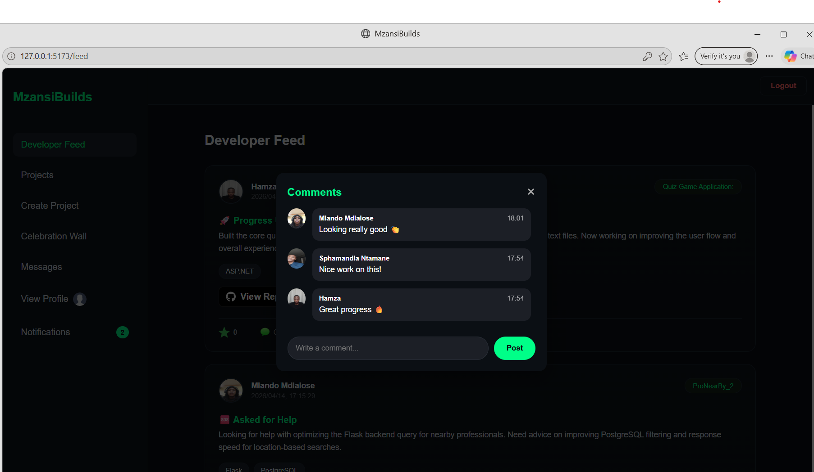

---

### Celebration Wall

Completed projects are displayed on a celebration wall to showcase successful builds.

  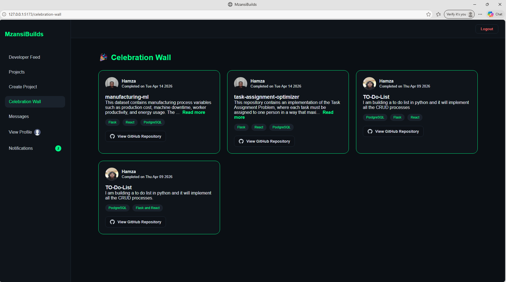

---

## Tech Stack

### Frontend

* React.js
* JavaScript
* CSS

### Backend

* Flask
* Python
* SQLAlchemy ORM

### Database

* PostgreSQL

I chose PostgreSQL for its strong relational capabilities and support for structured data relationships using foreign keys.

---

### Version Control

* Git
* GitHub

---

## System Architecture / UML Design

Below is the UML class diagram created during the planning phase.

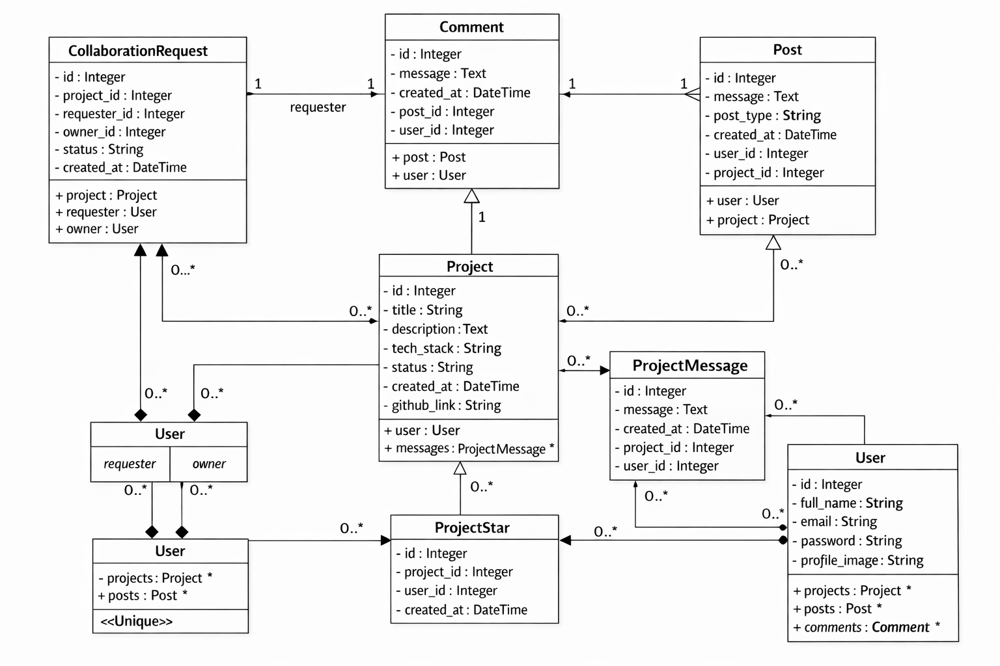

**Figure 1:** UML class diagram showing relationships between:

* User
* Project
* Post
* CollaborationRequest
* ProjectStar
* ProjectMessage

This UML was created before implementation to guide the database and system structure.

---

## Database Design

The backend database was implemented using PostgreSQL.

Key relationships include:

* one user can own many projects
* one project can contain many progress posts
* many users can star many projects
* collaboration requests connect developers to project owners
* project messages allow communication between collaborators

These relationships were implemented using SQLAlchemy ORM models.

---

## Software Engineering Best Practices

During development, the following best practices were applied:

* modular component design
* reusable frontend components
* clean backend route separation
* RESTful API structure
* clear naming conventions
* separation of frontend and backend concerns
* version control using Git

---

## CI / CD Workflow

Continuous integration principles were used to support code validation and workflow checks during development.

---

## Testing & Code Quality

  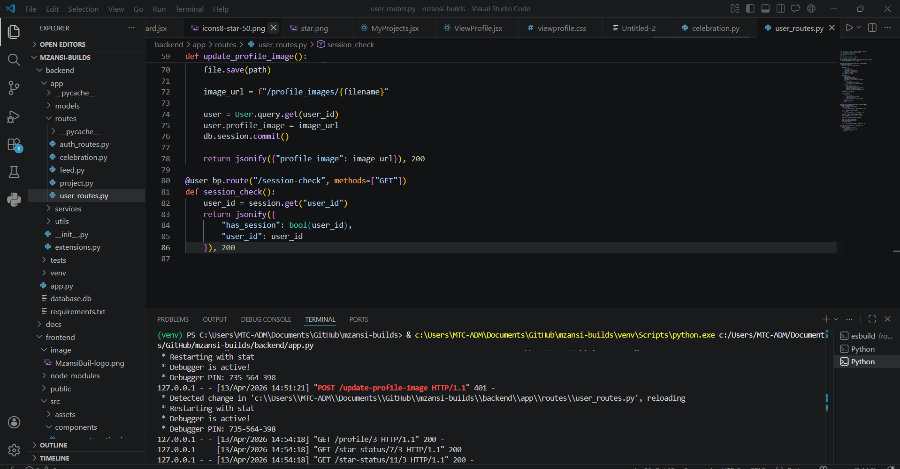
  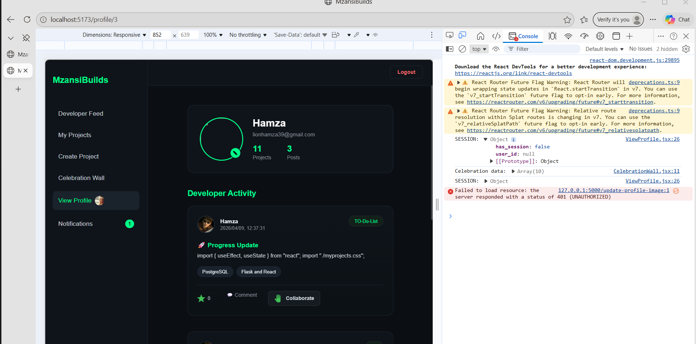
  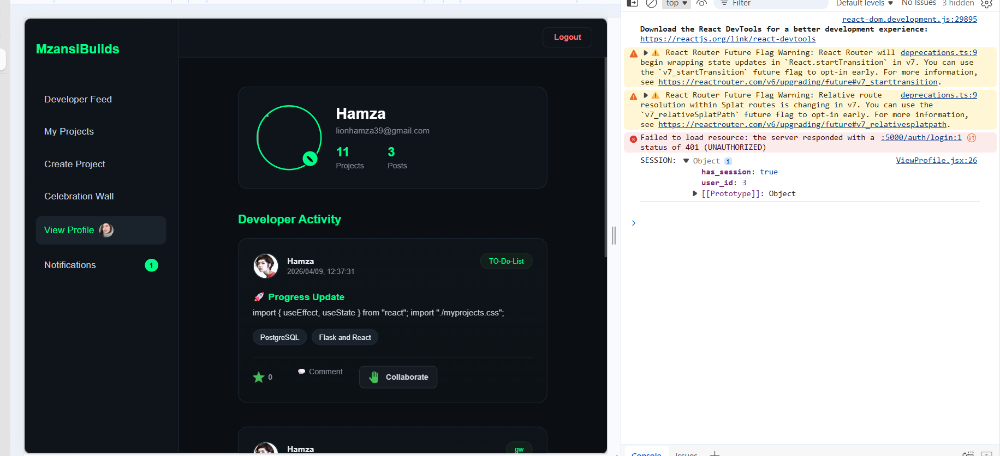

Testing and validation focused on:

* authentication and session handling
* project creation and update routes
* collaboration request and notification logic
* comment and star functionality
* frontend and backend interaction flows

---

## Security Considerations

Security was integrated into the design process through:

* protected authentication routes
* session management
* input validation
* ORM usage to reduce SQL injection risks
* access control checks
* safe database operations

---

## Git Workflow & Version Control

An incremental Git workflow was followed with structured commits such as:

* initial setup
* authentication implementation
* project feed development
* collaboration feature implementation
* star functionality
* UI improvements

---

## Reusability and Documentation

The project was designed with reusability in mind through:

* reusable React components
* reusable Flask routes
* modular database models
* shared utility functions
* maintainable folder structure

Documentation includes this README and the UML design.

---

## Evidence of My Own Thinking

This project demonstrates:

* requirement analysis
* project planning
* UML design
* architectural decisions
* security considerations
* testing workflow
* disciplined version control

---

## Author

**Hamza Madi**
